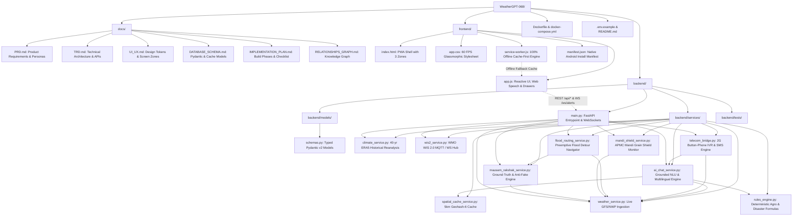

# System Relationships & Architecture Graph — WeatherGPT
**Purpose**: Comprehensive Machine-Readable Dependency & Relationship Graph  
**Target Audience**: AI Agents, System Architects, SIH Evaluators  
**Version**: 1.1.0 (With Mausam Rakshak Ground-Truth Engine)

This document defines the exact structural, functional, and data-flow relationships between every directory, file, service, and API in WeatherGPT. Any AI agent reading this document can navigate the entire repository without scanning raw source files.

---

## 1. Directory & File Relationship Graph



---

## 2. Granular Data Flow Lineages

### Flow A: Grounded Conversational AI Request Flow
```
User Utterance (Voice/Text)
       │
       ▼
frontend/app.js (Web Speech API Recognition)
       │ HTTP POST /api/chat
       ▼
backend/main.py
       │
       ▼
backend/services/ai_chat_service.py
       ├──> 1. Check backend/services/spatial_cache_service.py (Geohash 6)
       │       └── If Cache Hit ➔ Return Cached Advisory in 5ms (Zero LLM cost)
       │
       ├──> 2. Query backend/services/weather_service.py (Live GFS/ECMWF NWP Grid)
       │
       ├──> 3. Evaluate backend/services/rules_engine.py (Wash-off, Drift, VPD, WBGT)
       │
       └──> 4. Format verified answer (Cloud LLM or Deterministic Indic Fallback)
               └── Store result in spatial_cache_service.py (15-min TTL)
       │
       ▼
frontend/app.js (Renders Action Badge + Web Speech Synthesis Audio)
```

---

### Flow B: "Mausam Rakshak" Citizen Ground-Truth Validation Flow
```
Citizen Taps: "🧊 Hailstones falling in Wardha"
       │ HTTP POST /api/rakshak/report
       ▼
backend/services/mausam_rakshak_service.py
       ├──> 1. Spatial Consensus Check: K >= 3 reports in 2km/15min?
       ├──> 2. Satellite Physics Check: Queries weather_service.py for cloud top T_top <= -40°C
       ├──> 3. Updates User Reputation Score (+5 verified / -25 fake)
       └──> 4. Broadcasts verified warning via wis2_service.py to downwind communities
       │
       ▼
frontend/app.js (Places Golden Verified Pin on Micro-GIS Leaflet Map)
```

---

### Flow C: 2G Button-Phone Missed-Call IVR Flow
```
Farmer Dials 1800-XXX-XXXX on ₹1,000 Button Phone
       │ Inbound Telecom Call (Hangs up after 1 ring)
       ▼
Telecom Gateway Webhook ➔ POST /api/telecom/missed-call
       │
       ▼
backend/services/telecom_bridge.py
       ├──> 1. Looks up caller circle & language preference (e.g. Maharashtra ➔ Marathi)
       ├──> 2. Queries weather_service.py for caller's district
       ├──> 3. Runs rules_engine.py for local crop spraying & rain window
       └──> 4. Prepares dynamic vernacular IVR speech script
       │
       ▼
Outbound Call Initiated to Farmer's Button Phone (Free Call)
       │ Farmer answers: "Namaste Ramesh-ji... Press 1 for Spraying, Press 2 to Ask"
       ▼
Farmer speaks question ➔ telecom_bridge.py ➔ ai_chat_service.py ➔ Speaks audio back!
```

---

### Flow D: Preemptive Flood Detour Navigation Flow
```
backend/services/weather_service.py (Doppler Radar Rain Rate > 35 mm/h)
AND/OR backend/services/mausam_rakshak_service.py (Citizen reports Knee-Deep water)
       │
       ▼
backend/services/flood_routing_service.py
       ├──> Compares rain intensity against Digital Elevation Model (DEM)
       ├──> Evaluates drainage capacity of local Railway Underbridges (RUBs)
       └──> Flags underpass as "CRITICAL WATERLOGGING IN 20 MINS"
       │
       ▼
backend/services/wis2_service.py (Broadcasts alert over WebSocket)
       │
       ▼
frontend/app.js (Displays High-Ground Elevation Detour Route)
       └── "⚠️ Avoid Subway Link. Take Flyover (+4 mins, +3.5m higher, 100% dry)"
```

---

### Flow E: APMC Mandi Grain Shield Alert Flow
```
backend/services/weather_service.py (Convective squall detected 40km away)
       │
       ▼
backend/services/mandi_shield_service.py
       ├──> Computes storm vector (Direction: East, Speed: 25 km/h)
       └──> Identifies registered APMC Mandis in storm path
       │
       ▼
Triggers 4-Hour Countdown Advisory:
       └── "APMC Wardha: Rain arriving in 2h 15m. Cover open grain heaps immediately!"
```

---

## 3. Directory Responsibility Matrix

| Path | Primary Responsibility | Critical Consumers |
| :--- | :--- | :--- |
| `backend/models/schemas.py` | Single source of truth for all Pydantic v2 data contracts | All services and API routes |
| `backend/services/spatial_cache_service.py` | 5km Geohash 6 deduplication & RAM cache (98% cost saver) | `ai_chat_service.py` |
| `backend/services/weather_service.py` | Live GFS/ECMWF atmospheric physics data ingestion | `rules_engine.py`, `ai_chat_service.py`, `flood_routing_service.py`, `mausam_rakshak_service.py` |
| `backend/services/rules_engine.py` | Deterministic agronomic & disaster mathematical formulas | `ai_chat_service.py`, `telecom_bridge.py` |
| `backend/services/ai_chat_service.py` | Grounded intent parsing, hybrid LLM, & Indic template fallback | `main.py`, `telecom_bridge.py` |
| `backend/services/climate_service.py` | 40-year ERA5 historical climate reanalysis & anomaly detection | `main.py` |
| `backend/services/wis2_service.py` | WMO WIS 2.0 MQTT topic publisher & WebSocket alert hub | `main.py`, `frontend/app.js` |
| `backend/services/telecom_bridge.py` | 2G button-phone missed-call IVR & 160-char SMS generator | `main.py` |
| `backend/services/flood_routing_service.py` | Preemptive underpass inundation prediction & elevation bypass | `main.py`, `frontend/app.js` |
| `backend/services/mandi_shield_service.py` | APMC Mandi open storage cloudburst monitoring | `main.py`, `frontend/app.js` |
| `backend/services/mausam_rakshak_service.py` | 1-tap citizen ground-truth hazard validation & satellite checks | `main.py`, `flood_routing_service.py`, `wis2_service.py` |
| `frontend/index.html` | Universal PWA shell with 3-Zone layout & drawers | End users, Mobile browsers |
| `frontend/app.css` | 60 FPS glassmorphic stylesheet optimized for 2GB RAM phones | `index.html` |
| `frontend/app.js` | Reactive UI controller, Web Speech API, & offline state | `index.html` |
| `frontend/service-worker.js` | Cache-first offline storage strategy (100% blackout survivability) | Browser Service Worker |
