# ChatResponse

> God node · 19 connections · [C:\WeatherGPT-068\backend\models\schemas.py](file:///C:/WeatherGPT-068/backend/models/schemas.py#L81)

## Call Trace Diagram

```mermaid
sequenceDiagram
    participant P0 as ChatResponse
    participant P1 as .process_query()
    participant P2 as .get()
    participant P3 as .get_forecast()
    participant P4 as .check_mandi_risk()
    participant P5 as ._parse_open_meteo_response()
    participant P6 as .get_climate_comparison()
    participant P7 as .submit_report()
    participant P8 as ._generate_key()
    participant P9 as test_api_health()
    participant P10 as test_api_weather_current()
    participant P11 as test_api_alerts_active()
    participant P12 as test_api_climate_compare()
    participant P13 as test_api_telecom_sms_payload()
    participant P14 as test_api_flood_detour()
    participant P15 as test_api_mandi_status()
    participant P16 as test_api_rakshak_report_and_pins()
    participant P17 as .evaluate_agro_spray()
    participant P18 as .set()
    participant P19 as test_chat_spray_query_intent()
    participant P20 as chat_interaction()
    participant P21 as test_spatial_cache_deduplication()
    participant P22 as ._detect_intent_and_entity()
    participant P23 as ._format_agromet_response()
    participant P24 as ._format_disaster_response()
    participant P25 as ._format_flood_response()
    participant P26 as ._format_commute_response()
    participant P27 as WeatherGPT — FastAPI ASGI Application. Central orchestration layer serving REST
    participant P28 as System health and operational telemetry.
    participant P29 as Retrieves live NWP atmospheric physics metrics and 3-hour nowcast slider.
    participant P30 as Processes conversational query with intent extraction and spatial caching.
    participant P31 as Retrieves active NDMA CAP alerts and Damini lightning vectors.
    participant P32 as Compares current conditions against 40-year ERA5 historical normal.
    participant P33 as Simulates 2G button-phone missed call and triggers automated IVR callback.
    participant P34 as Generates 160-character compressed GSM 03.38 payload for total data blackouts.
    participant P35 as Preemptive underpass waterlogging prediction and high-elevation bypass.
    participant P36 as Monitors open-air grain yard cloudburst risk.
    participant P37 as Mausam Rakshak 1-tap crowdsourced ground-truth reporting with anti-fake verifica
    participant P38 as Retrieves active verified ground-truth pins for map rendering.
    participant P39 as Returns spatial deduplication cache metrics and cost savings.
    participant P40 as WMO WIS 2.0 real-time alert streaming connection.
    participant P41 as AIChatService
    participant P42 as Conversational AI Service. Integrates Grounded Intent Parsing, Spatial Semantic
    P0->>+ P1: calls
    P1-->>- P0: return
    P1->>+ P0: calls
    P0-->>- P1: return
    P1->>+ P2: calls
    P2-->>- P1: return
    P2->>+ P1: calls
    P1-->>- P2: return
    P2->>+ P3: calls
    P3-->>- P2: return
    P2->>+ P4: calls
    P4-->>- P2: return
    P2->>+ P5: calls
    P5-->>- P2: return
    P2->>+ P6: calls
    P6-->>- P2: return
    P2->>+ P7: calls
    P7-->>- P2: return
    P2->>+ P8: calls
    P8-->>- P2: return
    P2->>+ P9: calls
    P9-->>- P2: return
    P2->>+ P10: calls
    P10-->>- P2: return
    P2->>+ P11: calls
    P11-->>- P2: return
    P2->>+ P12: calls
    P12-->>- P2: return
    P2->>+ P13: calls
    P13-->>- P2: return
    P2->>+ P14: calls
    P14-->>- P2: return
    P2->>+ P15: calls
    P15-->>- P2: return
    P2->>+ P16: calls
    P16-->>- P2: return
    P1->>+ P3: calls
    P3-->>- P1: return
    P1->>+ P17: calls
    P17-->>- P1: return
    P1->>+ P18: calls
    P18-->>- P1: return
    P1->>+ P19: calls
    P19-->>- P1: return
    P1->>+ P20: calls
    P20-->>- P1: return
    P1->>+ P21: calls
    P21-->>- P1: return
    P1->>+ P22: calls
    P22-->>- P1: return
    P1->>+ P23: calls
    P23-->>- P1: return
    P1->>+ P24: calls
    P24-->>- P1: return
    P1->>+ P25: calls
    P25-->>- P1: return
    P1->>+ P26: calls
    P26-->>- P1: return
    P0->>+ P27: uses
    P27-->>- P0: return
    P0->>+ P28: uses
    P28-->>- P0: return
    P0->>+ P29: uses
    P29-->>- P0: return
    P0->>+ P30: uses
    P30-->>- P0: return
    P0->>+ P31: uses
    P31-->>- P0: return
    P0->>+ P32: uses
    P32-->>- P0: return
    P0->>+ P33: uses
    P33-->>- P0: return
    P0->>+ P34: uses
    P34-->>- P0: return
    P0->>+ P35: uses
    P35-->>- P0: return
    P0->>+ P36: uses
    P36-->>- P0: return
    P0->>+ P37: uses
    P37-->>- P0: return
    P0->>+ P38: uses
    P38-->>- P0: return
    P0->>+ P39: uses
    P39-->>- P0: return
    P0->>+ P40: uses
    P40-->>- P0: return
    P0->>+ P41: uses
    P41-->>- P0: return
    P0->>+ P42: uses
    P42-->>- P0: return
```

## Connections by Relation

### calls
- [[.process_query()]] `INFERRED`

### contains
- [[schemas.py]] `EXTRACTED`

### inherits
- [[BaseModel]] `EXTRACTED`

### uses
- [[WeatherGPT — FastAPI ASGI Application. Central orchestration layer serving REST]] `INFERRED`
- [[System health and operational telemetry.]] `INFERRED`
- [[Retrieves live NWP atmospheric physics metrics and 3-hour nowcast slider.]] `INFERRED`
- [[Processes conversational query with intent extraction and spatial caching.]] `INFERRED`
- [[Retrieves active NDMA CAP alerts and Damini lightning vectors.]] `INFERRED`
- [[Compares current conditions against 40-year ERA5 historical normal.]] `INFERRED`
- [[Simulates 2G button-phone missed call and triggers automated IVR callback.]] `INFERRED`
- [[Generates 160-character compressed GSM 03.38 payload for total data blackouts.]] `INFERRED`
- [[Preemptive underpass waterlogging prediction and high-elevation bypass.]] `INFERRED`
- [[Monitors open-air grain yard cloudburst risk.]] `INFERRED`
- [[Mausam Rakshak 1-tap crowdsourced ground-truth reporting with anti-fake verifica]] `INFERRED`
- [[Retrieves active verified ground-truth pins for map rendering.]] `INFERRED`
- [[Returns spatial deduplication cache metrics and cost savings.]] `INFERRED`
- [[WMO WIS 2.0 real-time alert streaming connection.]] `INFERRED`
- [[AIChatService]] `INFERRED`
- [[Conversational AI Service. Integrates Grounded Intent Parsing, Spatial Semantic]] `INFERRED`

---

*Part of the graphify knowledge wiki. See [[index]] to navigate.*