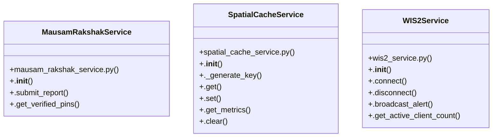

# Community 0

> 32 nodes · cohesion 0.09

## Key Concepts

- [main.py](file:///C:/WeatherGPT-068/backend/main.py#L1) (24 connections)
- [SpatialCacheService](file:///C:/WeatherGPT-068/backend/services/spatial_cache_service.py#L50) (7 connections)
- [MausamRakshakService](file:///C:/WeatherGPT-068/backend/services/mausam_rakshak_service.py#L15) (6 connections)
- [.set()](file:///C:/WeatherGPT-068/backend/services/spatial_cache_service.py#L81) (6 connections)
- [WIS2Service](file:///C:/WeatherGPT-068/backend/services/wis2_service.py#L12) (6 connections)
- [spatial_cache_service.py](file:///C:/WeatherGPT-068/backend/services/spatial_cache_service.py#L1) (5 connections)
- [.submit_report()](file:///C:/WeatherGPT-068/backend/services/mausam_rakshak_service.py#L21) (5 connections)
- [mausam_rakshak_service.py](file:///C:/WeatherGPT-068/backend/services/mausam_rakshak_service.py#L1) (4 connections)
- [health_check()](file:///C:/WeatherGPT-068/backend/main.py#L49) (4 connections)
- [submit_citizen_report()](file:///C:/WeatherGPT-068/backend/main.py#L157) (4 connections)
- [websocket_alerts_endpoint()](file:///C:/WeatherGPT-068/backend/main.py#L190) (4 connections)
- [encode_geohash()](file:///C:/WeatherGPT-068/backend/services/spatial_cache_service.py#L14) (4 connections)
- [._generate_key()](file:///C:/WeatherGPT-068/backend/services/spatial_cache_service.py#L57) (4 connections)
- [.broadcast_alert()](file:///C:/WeatherGPT-068/backend/services/wis2_service.py#L23) (4 connections)
- [wis2_service.py](file:///C:/WeatherGPT-068/backend/services/wis2_service.py#L1) (3 connections)
- [get_active_alerts()](file:///C:/WeatherGPT-068/backend/main.py#L76) (3 connections)
- [get_cache_statistics()](file:///C:/WeatherGPT-068/backend/main.py#L184) (3 connections)
- [get_current_weather()](file:///C:/WeatherGPT-068/backend/main.py#L61) (3 connections)
- [get_verified_ground_pins()](file:///C:/WeatherGPT-068/backend/main.py#L175) (3 connections)
- [Mausam Rakshak Citizen Ground-Truth Service. Validates 1-tap crowdsourced hazard](file:///C:/WeatherGPT-068/backend/services/mausam_rakshak_service.py#L1) (3 connections)
- [.get_metrics()](file:///C:/WeatherGPT-068/backend/services/spatial_cache_service.py#L96) (3 connections)
- [.get_verified_pins()](file:///C:/WeatherGPT-068/backend/services/mausam_rakshak_service.py#L96) (2 connections)
- [.connect()](file:///C:/WeatherGPT-068/backend/services/wis2_service.py#L16) (2 connections)
- [.disconnect()](file:///C:/WeatherGPT-068/backend/services/wis2_service.py#L20) (2 connections)
- [.get_active_client_count()](file:///C:/WeatherGPT-068/backend/services/wis2_service.py#L41) (2 connections)
- *... and 7 more nodes in this community*

## Class Diagram

## Relationships

- [[Community 1]] (8 shared connections)

## Source Files

- [C:\WeatherGPT-068\backend\main.py](file:///C:/WeatherGPT-068/backend/main.py)
- [C:\WeatherGPT-068\backend\services\mausam_rakshak_service.py](file:///C:/WeatherGPT-068/backend/services/mausam_rakshak_service.py)
- [C:\WeatherGPT-068\backend\services\spatial_cache_service.py](file:///C:/WeatherGPT-068/backend/services/spatial_cache_service.py)
- [C:\WeatherGPT-068\backend\services\wis2_service.py](file:///C:/WeatherGPT-068/backend/services/wis2_service.py)

## Audit Trail

- EXTRACTED: 94 (76%)
- INFERRED: 30 (24%)
- AMBIGUOUS: 0 (0%)

---

*Part of the graphify knowledge wiki. See [[index]] to navigate.*