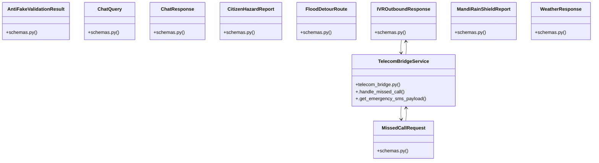

# Community 1

> 29 nodes · cohesion 0.36

## Key Concepts

- [ChatQuery](file:///C:/WeatherGPT-068/backend/models/schemas.py#L73) (20 connections)
- [IVROutboundResponse](file:///C:/WeatherGPT-068/backend/models/schemas.py#L122) (20 connections)
- [MissedCallRequest](file:///C:/WeatherGPT-068/backend/models/schemas.py#L115) (20 connections)
- [WeatherResponse](file:///C:/WeatherGPT-068/backend/models/schemas.py#L35) (20 connections)
- [AntiFakeValidationResult](file:///C:/WeatherGPT-068/backend/models/schemas.py#L103) (19 connections)
- [ChatResponse](file:///C:/WeatherGPT-068/backend/models/schemas.py#L81) (19 connections)
- [CitizenHazardReport](file:///C:/WeatherGPT-068/backend/models/schemas.py#L93) (19 connections)
- [FloodDetourRoute](file:///C:/WeatherGPT-068/backend/models/schemas.py#L129) (19 connections)
- [MandiRainShieldReport](file:///C:/WeatherGPT-068/backend/models/schemas.py#L139) (19 connections)
- **BaseModel** (13 connections)
- [WeatherGPT — FastAPI ASGI Application. Central orchestration layer serving REST](file:///C:/WeatherGPT-068/backend/main.py#L1) (10 connections)
- [Compares current conditions against 40-year ERA5 historical normal.](file:///C:/WeatherGPT-068/backend/main.py#L122) (10 connections)
- [Simulates 2G button-phone missed call and triggers automated IVR callback.](file:///C:/WeatherGPT-068/backend/main.py#L128) (10 connections)
- [Generates 160-character compressed GSM 03.38 payload for total data blackouts.](file:///C:/WeatherGPT-068/backend/main.py#L137) (10 connections)
- [Preemptive underpass waterlogging prediction and high-elevation bypass.](file:///C:/WeatherGPT-068/backend/main.py#L146) (10 connections)
- [Monitors open-air grain yard cloudburst risk.](file:///C:/WeatherGPT-068/backend/main.py#L152) (10 connections)
- [Mausam Rakshak 1-tap crowdsourced ground-truth reporting with anti-fake verifica](file:///C:/WeatherGPT-068/backend/main.py#L158) (10 connections)
- [Retrieves active verified ground-truth pins for map rendering.](file:///C:/WeatherGPT-068/backend/main.py#L179) (10 connections)
- [Returns spatial deduplication cache metrics and cost savings.](file:///C:/WeatherGPT-068/backend/main.py#L185) (10 connections)
- [WMO WIS 2.0 real-time alert streaming connection.](file:///C:/WeatherGPT-068/backend/main.py#L191) (10 connections)
- [System health and operational telemetry.](file:///C:/WeatherGPT-068/backend/main.py#L50) (10 connections)
- [Retrieves live NWP atmospheric physics metrics and 3-hour nowcast slider.](file:///C:/WeatherGPT-068/backend/main.py#L65) (10 connections)
- [Processes conversational query with intent extraction and spatial caching.](file:///C:/WeatherGPT-068/backend/main.py#L71) (10 connections)
- [Retrieves active NDMA CAP alerts and Damini lightning vectors.](file:///C:/WeatherGPT-068/backend/main.py#L80) (10 connections)
- [TelecomBridgeService](file:///C:/WeatherGPT-068/backend/services/telecom_bridge.py#L14) (5 connections)
- *... and 4 more nodes in this community*

## Class Diagram

## Relationships

- [[Community 2]] (3 shared connections)
- [[Community 0]] (2 shared connections)
- [[Community 3]] (2 shared connections)

## Source Files

- [C:\WeatherGPT-068\backend\main.py](file:///C:/WeatherGPT-068/backend/main.py)
- [C:\WeatherGPT-068\backend\models\schemas.py](file:///C:/WeatherGPT-068/backend/models/schemas.py)
- [C:\WeatherGPT-068\backend\services\ai_chat_service.py](file:///C:/WeatherGPT-068/backend/services/ai_chat_service.py)
- [C:\WeatherGPT-068\backend\services\telecom_bridge.py](file:///C:/WeatherGPT-068/backend/services/telecom_bridge.py)

## Audit Trail

- EXTRACTED: 53 (15%)
- INFERRED: 294 (85%)
- AMBIGUOUS: 0 (0%)

---

*Part of the graphify knowledge wiki. See [[index]] to navigate.*