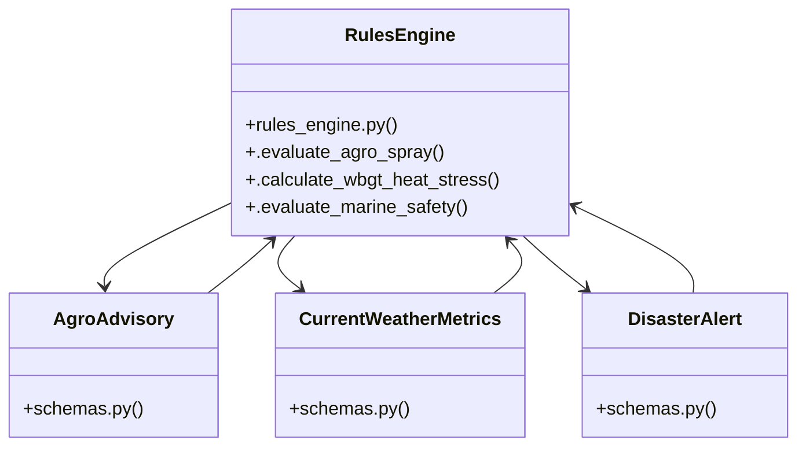

# Community 2

> 28 nodes · cohesion 0.15

## Key Concepts

- [schemas.py](file:///C:/WeatherGPT-068/backend/models/schemas.py#L1) (22 connections)
- [CurrentWeatherMetrics](file:///C:/WeatherGPT-068/backend/models/schemas.py#L10) (12 connections)
- [weather_service.py](file:///C:/WeatherGPT-068/backend/services/weather_service.py#L1) (8 connections)
- [AgroAdvisory](file:///C:/WeatherGPT-068/backend/models/schemas.py#L45) (8 connections)
- [ai_chat_service.py](file:///C:/WeatherGPT-068/backend/services/ai_chat_service.py#L1) (7 connections)
- [RulesEngine](file:///C:/WeatherGPT-068/backend/services/rules_engine.py#L10) (7 connections)
- [DisasterAlert](file:///C:/WeatherGPT-068/backend/models/schemas.py#L59) (7 connections)
- [telecom_bridge.py](file:///C:/WeatherGPT-068/backend/services/telecom_bridge.py#L1) (6 connections)
- [.evaluate_agro_spray()](file:///C:/WeatherGPT-068/backend/services/rules_engine.py#L11) (6 connections)
- [flood_routing_service.py](file:///C:/WeatherGPT-068/backend/services/flood_routing_service.py#L1) (5 connections)
- [mandi_shield_service.py](file:///C:/WeatherGPT-068/backend/services/mandi_shield_service.py#L1) (5 connections)
- [rules_engine.py](file:///C:/WeatherGPT-068/backend/services/rules_engine.py#L1) (5 connections)
- [test_rules.py](file:///C:/WeatherGPT-068/backend/tests/test_rules.py#L1) (5 connections)
- [Deterministic Scientific Rules Engine. Pure mathematical computation of Agro-Met](file:///C:/WeatherGPT-068/backend/services/rules_engine.py#L1) (4 connections)
- [Evaluates pesticide & chemical fertilizer spray safety.         Rule 1: Rain pro](file:///C:/WeatherGPT-068/backend/services/rules_engine.py#L12) (4 connections)
- [Calculates simplified Wet-Bulb Globe Temperature (WBGT) for outdoor labor safety](file:///C:/WeatherGPT-068/backend/services/rules_engine.py#L62) (4 connections)
- [Evaluates coastal craft and artisanal fishing boat sea-state safety.](file:///C:/WeatherGPT-068/backend/services/rules_engine.py#L97) (4 connections)
- [get_dummy_current()](file:///C:/WeatherGPT-068/backend/tests/test_rules.py#L5) (4 connections)
- [Live Meteorological Ingestion Service. Fetches high-resolution GFS/ECMWF numeric](file:///C:/WeatherGPT-068/backend/services/weather_service.py#L1) (4 connections)
- [.calculate_wbgt_heat_stress()](file:///C:/WeatherGPT-068/backend/services/rules_engine.py#L61) (3 connections)
- [.evaluate_marine_safety()](file:///C:/WeatherGPT-068/backend/services/rules_engine.py#L96) (3 connections)
- [test_agro_spray_safe()](file:///C:/WeatherGPT-068/backend/tests/test_rules.py#L21) (3 connections)
- [test_agro_spray_unsafe_wash_off()](file:///C:/WeatherGPT-068/backend/tests/test_rules.py#L28) (3 connections)
- [Preemptive Flood Detour Navigator. Pairs live radar precipitation intensity with](file:///C:/WeatherGPT-068/backend/services/flood_routing_service.py#L1) (2 connections)
- [APMC Mandi Grain Shield Service. Monitors open-air grain storage yards and trigg](file:///C:/WeatherGPT-068/backend/services/mandi_shield_service.py#L1) (2 connections)
- *... and 3 more nodes in this community*

## Class Diagram

## Relationships

- [[Community 1]] (2 shared connections)

## Source Files

- [C:\WeatherGPT-068\backend\models\schemas.py](file:///C:/WeatherGPT-068/backend/models/schemas.py)
- [C:\WeatherGPT-068\backend\services\ai_chat_service.py](file:///C:/WeatherGPT-068/backend/services/ai_chat_service.py)
- [C:\WeatherGPT-068\backend\services\flood_routing_service.py](file:///C:/WeatherGPT-068/backend/services/flood_routing_service.py)
- [C:\WeatherGPT-068\backend\services\mandi_shield_service.py](file:///C:/WeatherGPT-068/backend/services/mandi_shield_service.py)
- [C:\WeatherGPT-068\backend\services\rules_engine.py](file:///C:/WeatherGPT-068/backend/services/rules_engine.py)
- [C:\WeatherGPT-068\backend\services\telecom_bridge.py](file:///C:/WeatherGPT-068/backend/services/telecom_bridge.py)
- [C:\WeatherGPT-068\backend\services\weather_service.py](file:///C:/WeatherGPT-068/backend/services/weather_service.py)
- [C:\WeatherGPT-068\backend\tests\test_rules.py](file:///C:/WeatherGPT-068/backend/tests/test_rules.py)

## Audit Trail

- EXTRACTED: 96 (65%)
- INFERRED: 52 (35%)
- AMBIGUOUS: 0 (0%)

---

*Part of the graphify knowledge wiki. See [[index]] to navigate.*