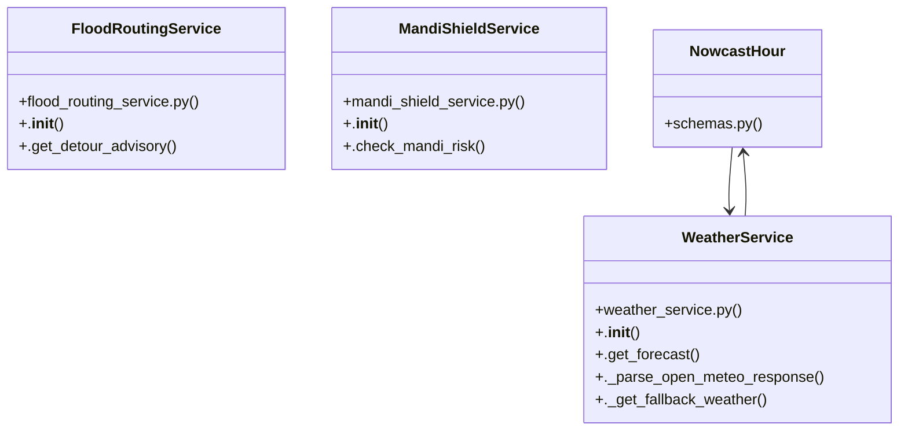

# Community 3

> 26 nodes · cohesion 0.10

## Key Concepts

- [.get_forecast()](file:///C:/WeatherGPT-068/backend/services/weather_service.py#L42) (13 connections)
- [WeatherService](file:///C:/WeatherGPT-068/backend/services/weather_service.py#L37) (8 connections)
- [.check_mandi_risk()](file:///C:/WeatherGPT-068/backend/services/mandi_shield_service.py#L19) (6 connections)
- [NowcastHour](file:///C:/WeatherGPT-068/backend/models/schemas.py#L25) (6 connections)
- [._parse_open_meteo_response()](file:///C:/WeatherGPT-068/backend/services/weather_service.py#L76) (6 connections)
- [test_safety_suite.py](file:///C:/WeatherGPT-068/backend/tests/test_safety_suite.py#L1) (5 connections)
- [.get_detour_advisory()](file:///C:/WeatherGPT-068/backend/services/flood_routing_service.py#L35) (5 connections)
- [.get_emergency_sms_payload()](file:///C:/WeatherGPT-068/backend/services/telecom_bridge.py#L47) (5 connections)
- [._get_fallback_weather()](file:///C:/WeatherGPT-068/backend/services/weather_service.py#L149) (5 connections)
- [FloodRoutingService](file:///C:/WeatherGPT-068/backend/services/flood_routing_service.py#L13) (4 connections)
- [MandiShieldService](file:///C:/WeatherGPT-068/backend/services/mandi_shield_service.py#L12) (4 connections)
- [get_compressed_sms()](file:///C:/WeatherGPT-068/backend/main.py#L133) (3 connections)
- [get_flood_detour()](file:///C:/WeatherGPT-068/backend/main.py#L142) (3 connections)
- [get_mandi_status()](file:///C:/WeatherGPT-068/backend/main.py#L151) (3 connections)
- [Generates ultra-dense 160-character USSD/SMS payload for transmission during tot](file:///C:/WeatherGPT-068/backend/services/telecom_bridge.py#L48) (3 connections)
- [test_mausam_rakshak_anti_fake_verification()](file:///C:/WeatherGPT-068/backend/tests/test_safety_suite.py#L42) (3 connections)
- [test_telecom_bridge_missed_call()](file:///C:/WeatherGPT-068/backend/tests/test_safety_suite.py#L23) (3 connections)
- [test_weather.py](file:///C:/WeatherGPT-068/backend/tests/test_weather.py#L1) (2 connections)
- [test_emergency_sms_payload()](file:///C:/WeatherGPT-068/backend/tests/test_safety_suite.py#L36) (2 connections)
- [test_flood_routing_detour()](file:///C:/WeatherGPT-068/backend/tests/test_safety_suite.py#L16) (2 connections)
- [test_mandi_shield_risk()](file:///C:/WeatherGPT-068/backend/tests/test_safety_suite.py#L9) (2 connections)
- [test_get_forecast_live()](file:///C:/WeatherGPT-068/backend/tests/test_weather.py#L5) (2 connections)
- [test_weather_memory_cache()](file:///C:/WeatherGPT-068/backend/tests/test_weather.py#L16) (2 connections)
- [.__init__()](file:///C:/WeatherGPT-068/backend/services/flood_routing_service.py#L14) (1 connections)
- [.__init__()](file:///C:/WeatherGPT-068/backend/services/mandi_shield_service.py#L13) (1 connections)
- *... and 1 more nodes in this community*

## Class Diagram

## Relationships

- [[Community 1]] (3 shared connections)
- [[Community 2]] (1 shared connections)

## Source Files

- [C:\WeatherGPT-068\backend\main.py](file:///C:/WeatherGPT-068/backend/main.py)
- [C:\WeatherGPT-068\backend\models\schemas.py](file:///C:/WeatherGPT-068/backend/models/schemas.py)
- [C:\WeatherGPT-068\backend\services\flood_routing_service.py](file:///C:/WeatherGPT-068/backend/services/flood_routing_service.py)
- [C:\WeatherGPT-068\backend\services\mandi_shield_service.py](file:///C:/WeatherGPT-068/backend/services/mandi_shield_service.py)
- [C:\WeatherGPT-068\backend\services\telecom_bridge.py](file:///C:/WeatherGPT-068/backend/services/telecom_bridge.py)
- [C:\WeatherGPT-068\backend\services\weather_service.py](file:///C:/WeatherGPT-068/backend/services/weather_service.py)
- [C:\WeatherGPT-068\backend\tests\test_safety_suite.py](file:///C:/WeatherGPT-068/backend/tests/test_safety_suite.py)
- [C:\WeatherGPT-068\backend\tests\test_weather.py](file:///C:/WeatherGPT-068/backend/tests/test_weather.py)

## Audit Trail

- EXTRACTED: 48 (48%)
- INFERRED: 52 (52%)
- AMBIGUOUS: 0 (0%)

---

*Part of the graphify knowledge wiki. See [[index]] to navigate.*