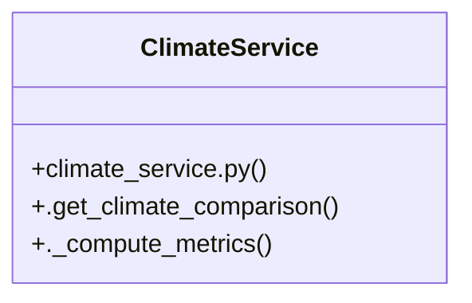

# Community 5

> 19 nodes · cohesion 0.15

## Key Concepts

- [.get()](file:///C:/WeatherGPT-068/backend/services/spatial_cache_service.py#L64) (16 connections)
- [test_api_endpoints.py](file:///C:/WeatherGPT-068/backend/tests/test_api_endpoints.py#L1) (10 connections)
- [.get_climate_comparison()](file:///C:/WeatherGPT-068/backend/services/climate_service.py#L11) (5 connections)
- [climate_service.py](file:///C:/WeatherGPT-068/backend/services/climate_service.py#L1) (3 connections)
- [ClimateService](file:///C:/WeatherGPT-068/backend/services/climate_service.py#L10) (3 connections)
- [get_climate_trend()](file:///C:/WeatherGPT-068/backend/main.py#L118) (3 connections)
- [._compute_metrics()](file:///C:/WeatherGPT-068/backend/services/climate_service.py#L36) (2 connections)
- [test_api_alerts_active()](file:///C:/WeatherGPT-068/backend/tests/test_api_endpoints.py#L35) (2 connections)
- [test_api_climate_compare()](file:///C:/WeatherGPT-068/backend/tests/test_api_endpoints.py#L42) (2 connections)
- [test_api_flood_detour()](file:///C:/WeatherGPT-068/backend/tests/test_api_endpoints.py#L67) (2 connections)
- [test_api_health()](file:///C:/WeatherGPT-068/backend/tests/test_api_endpoints.py#L7) (2 connections)
- [test_api_mandi_status()](file:///C:/WeatherGPT-068/backend/tests/test_api_endpoints.py#L73) (2 connections)
- [test_api_rakshak_report_and_pins()](file:///C:/WeatherGPT-068/backend/tests/test_api_endpoints.py#L79) (2 connections)
- [test_api_telecom_sms_payload()](file:///C:/WeatherGPT-068/backend/tests/test_api_endpoints.py#L61) (2 connections)
- [test_api_weather_current()](file:///C:/WeatherGPT-068/backend/tests/test_api_endpoints.py#L14) (2 connections)
- [Climate History & Reanalysis Service. Queries 40-year historical ERA5 reanalysis](file:///C:/WeatherGPT-068/backend/services/climate_service.py#L1) (1 connections)
- [Compares current 10-day rainfall against 30-year historical ERA5 normal.](file:///C:/WeatherGPT-068/backend/services/climate_service.py#L12) (1 connections)
- [test_api_chat_interaction()](file:///C:/WeatherGPT-068/backend/tests/test_api_endpoints.py#L22) (1 connections)
- [test_api_telecom_missed_call()](file:///C:/WeatherGPT-068/backend/tests/test_api_endpoints.py#L49) (1 connections)

## Class Diagram

## Relationships

- [[Community 1]] (1 shared connections)

## Source Files

- [C:\WeatherGPT-068\backend\main.py](file:///C:/WeatherGPT-068/backend/main.py)
- [C:\WeatherGPT-068\backend\services\climate_service.py](file:///C:/WeatherGPT-068/backend/services/climate_service.py)
- [C:\WeatherGPT-068\backend\services\spatial_cache_service.py](file:///C:/WeatherGPT-068/backend/services/spatial_cache_service.py)
- [C:\WeatherGPT-068\backend\tests\test_api_endpoints.py](file:///C:/WeatherGPT-068/backend/tests/test_api_endpoints.py)

## Audit Trail

- EXTRACTED: 37 (60%)
- INFERRED: 25 (40%)
- AMBIGUOUS: 0 (0%)

---

*Part of the graphify knowledge wiki. See [[index]] to navigate.*