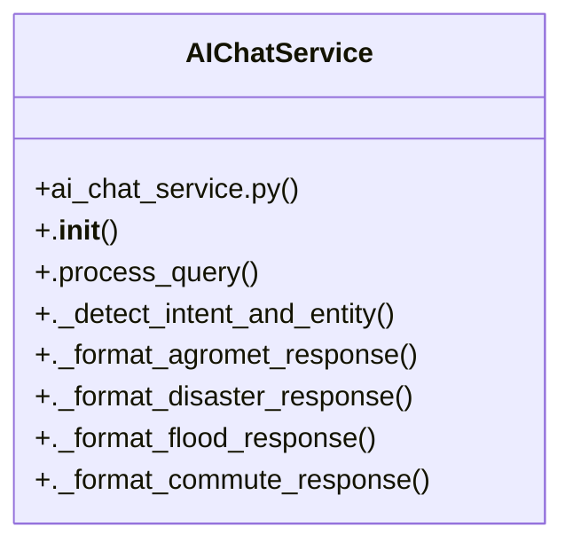

# Community 6

> 13 nodes · cohesion 0.23

## Key Concepts

- [.process_query()](file:///C:/WeatherGPT-068/backend/services/ai_chat_service.py#L21) (14 connections)
- [AIChatService](file:///C:/WeatherGPT-068/backend/services/ai_chat_service.py#L16) (10 connections)
- [test_chat_spray_query_intent()](file:///C:/WeatherGPT-068/backend/tests/test_chat.py#L6) (4 connections)
- [chat_interaction()](file:///C:/WeatherGPT-068/backend/main.py#L70) (3 connections)
- [test_spatial_cache_deduplication()](file:///C:/WeatherGPT-068/backend/tests/test_chat.py#L24) (3 connections)
- [._detect_intent_and_entity()](file:///C:/WeatherGPT-068/backend/services/ai_chat_service.py#L94) (2 connections)
- [._format_agromet_response()](file:///C:/WeatherGPT-068/backend/services/ai_chat_service.py#L120) (2 connections)
- [._format_commute_response()](file:///C:/WeatherGPT-068/backend/services/ai_chat_service.py#L207) (2 connections)
- [._format_disaster_response()](file:///C:/WeatherGPT-068/backend/services/ai_chat_service.py#L163) (2 connections)
- [._format_flood_response()](file:///C:/WeatherGPT-068/backend/services/ai_chat_service.py#L185) (2 connections)
- [test_chat.py](file:///C:/WeatherGPT-068/backend/tests/test_chat.py#L1) (2 connections)
- [.clear()](file:///C:/WeatherGPT-068/backend/services/spatial_cache_service.py#L111) (2 connections)
- [.__init__()](file:///C:/WeatherGPT-068/backend/services/ai_chat_service.py#L17) (1 connections)

## Class Diagram

## Relationships

- [[Community 1]] (1 shared connections)

## Source Files

- [C:\WeatherGPT-068\backend\main.py](file:///C:/WeatherGPT-068/backend/main.py)
- [C:\WeatherGPT-068\backend\services\ai_chat_service.py](file:///C:/WeatherGPT-068/backend/services/ai_chat_service.py)
- [C:\WeatherGPT-068\backend\services\spatial_cache_service.py](file:///C:/WeatherGPT-068/backend/services/spatial_cache_service.py)
- [C:\WeatherGPT-068\backend\tests\test_chat.py](file:///C:/WeatherGPT-068/backend/tests/test_chat.py)

## Audit Trail

- EXTRACTED: 32 (65%)
- INFERRED: 17 (35%)
- AMBIGUOUS: 0 (0%)

---

*Part of the graphify knowledge wiki. See [[index]] to navigate.*