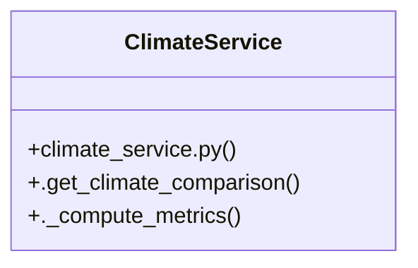

# Community 8

> 6 nodes · cohesion 0.40

## Key Concepts

- [Compares current conditions against 40-year ERA5 historical normal.](file:///C:/WeatherGPT-068/backend/main.py#L122) (10 connections)
- [.get_climate_comparison()](file:///C:/WeatherGPT-068/backend/services/climate_service.py#L11) (5 connections)
- [ClimateService](file:///C:/WeatherGPT-068/backend/services/climate_service.py#L10) (3 connections)
- [get_climate_trend()](file:///C:/WeatherGPT-068/backend/main.py#L118) (3 connections)
- [._compute_metrics()](file:///C:/WeatherGPT-068/backend/services/climate_service.py#L36) (2 connections)
- [Compares current 10-day rainfall against 30-year historical ERA5 normal.](file:///C:/WeatherGPT-068/backend/services/climate_service.py#L12) (1 connections)

## Class Diagram

## Relationships

- No strong cross-community connections detected

## Source Files

- [C:\WeatherGPT-068\backend\main.py](file:///C:/WeatherGPT-068/backend/main.py)
- [C:\WeatherGPT-068\backend\services\climate_service.py](file:///C:/WeatherGPT-068/backend/services/climate_service.py)

## Audit Trail

- EXTRACTED: 12 (50%)
- INFERRED: 12 (50%)
- AMBIGUOUS: 0 (0%)

---

*Part of the graphify knowledge wiki. See [[index]] to navigate.*