# CurrentWeatherMetrics

> God node · 12 connections · [C:\WeatherGPT-068\backend\models\schemas.py](file:///C:/WeatherGPT-068/backend/models/schemas.py#L10)

## Call Trace Diagram

```mermaid
sequenceDiagram
    participant P0 as CurrentWeatherMetrics
    participant P1 as WeatherService
    participant P2 as WeatherResponse
    participant P3 as WeatherGPT — FastAPI ASGI Application. Central orchestration layer serving REST
    participant P4 as System health and operational telemetry.
    participant P5 as Retrieves live NWP atmospheric physics metrics and 3-hour nowcast slider.
    participant P6 as Processes conversational query with intent extraction and spatial caching.
    participant P7 as Retrieves active NDMA CAP alerts and Damini lightning vectors.
    participant P8 as Compares current conditions against 40-year ERA5 historical normal.
    participant P9 as Simulates 2G button-phone missed call and triggers automated IVR callback.
    participant P10 as Generates 160-character compressed GSM 03.38 payload for total data blackouts.
    participant P11 as Preemptive underpass waterlogging prediction and high-elevation bypass.
    participant P12 as Monitors open-air grain yard cloudburst risk.
    participant P13 as Mausam Rakshak 1-tap crowdsourced ground-truth reporting with anti-fake verifica
    participant P14 as Retrieves active verified ground-truth pins for map rendering.
    participant P15 as Returns spatial deduplication cache metrics and cost savings.
    participant P16 as WMO WIS 2.0 real-time alert streaming connection.
    participant P17 as ._parse_open_meteo_response()
    participant P18 as ._get_fallback_weather()
    participant P19 as Live Meteorological Ingestion Service. Fetches high-resolution GFS/ECMWF numeric
    participant P20 as NowcastHour
    participant P21 as RulesEngine
    participant P22 as Deterministic Scientific Rules Engine. Pure mathematical computation of Agro-Met
    participant P23 as Evaluates pesticide & chemical fertilizer spray safety.         Rule 1: Rain pro
    participant P24 as Calculates simplified Wet-Bulb Globe Temperature (WBGT) for outdoor labor safety
    participant P25 as Evaluates coastal craft and artisanal fishing boat sea-state safety.
    participant P26 as get_dummy_current()
    P0->>+ P1: uses
    P1-->>- P0: return
    P1->>+ P2: uses
    P2-->>- P1: return
    P2->>+ P3: uses
    P3-->>- P2: return
    P2->>+ P4: uses
    P4-->>- P2: return
    P2->>+ P5: uses
    P5-->>- P2: return
    P2->>+ P6: uses
    P6-->>- P2: return
    P2->>+ P7: uses
    P7-->>- P2: return
    P2->>+ P8: uses
    P8-->>- P2: return
    P2->>+ P9: uses
    P9-->>- P2: return
    P2->>+ P10: uses
    P10-->>- P2: return
    P2->>+ P11: uses
    P11-->>- P2: return
    P2->>+ P12: uses
    P12-->>- P2: return
    P2->>+ P13: uses
    P13-->>- P2: return
    P2->>+ P14: uses
    P14-->>- P2: return
    P2->>+ P15: uses
    P15-->>- P2: return
    P2->>+ P16: uses
    P16-->>- P2: return
    P2->>+ P1: uses
    P1-->>- P2: return
    P2->>+ P17: calls
    P17-->>- P2: return
    P2->>+ P18: calls
    P18-->>- P2: return
    P2->>+ P19: uses
    P19-->>- P2: return
    P1->>+ P0: uses
    P0-->>- P1: return
    P1->>+ P20: uses
    P20-->>- P1: return
    P0->>+ P21: uses
    P21-->>- P0: return
    P0->>+ P17: calls
    P17-->>- P0: return
    P0->>+ P18: calls
    P18-->>- P0: return
    P0->>+ P22: uses
    P22-->>- P0: return
    P0->>+ P23: uses
    P23-->>- P0: return
    P0->>+ P24: uses
    P24-->>- P0: return
    P0->>+ P25: uses
    P25-->>- P0: return
    P0->>+ P19: uses
    P19-->>- P0: return
    P0->>+ P26: calls
    P26-->>- P0: return
```

## Connections by Relation

### calls
- [[._parse_open_meteo_response()]] `INFERRED`
- [[._get_fallback_weather()]] `INFERRED`
- [[get_dummy_current()]] `INFERRED`

### contains
- [[schemas.py]] `EXTRACTED`

### inherits
- [[BaseModel]] `EXTRACTED`

### uses
- [[WeatherService]] `INFERRED`
- [[RulesEngine]] `INFERRED`
- [[Deterministic Scientific Rules Engine. Pure mathematical computation of Agro-Met]] `INFERRED`
- [[Evaluates pesticide & chemical fertilizer spray safety.         Rule 1: Rain pro]] `INFERRED`
- [[Calculates simplified Wet-Bulb Globe Temperature (WBGT) for outdoor labor safety]] `INFERRED`
- [[Evaluates coastal craft and artisanal fishing boat sea-state safety.]] `INFERRED`
- [[Live Meteorological Ingestion Service. Fetches high-resolution GFS/ECMWF numeric]] `INFERRED`

---

*Part of the graphify knowledge wiki. See [[index]] to navigate.*