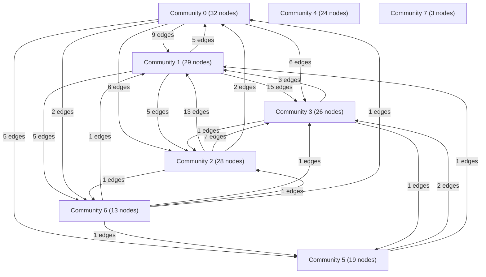

# Knowledge Graph Index

> Auto-generated by graphify. Start here — read community articles for context, then drill into god nodes for detail.

**174 nodes · 444 edges · 8 communities**

---

## System Architecture Flowchart

## Communities
(sorted by size, largest first)

- [[Community 0]] — 32 nodes
- [[Community 1]] — 29 nodes
- [[Community 2]] — 28 nodes
- [[Community 3]] — 26 nodes
- [[Community 4]] — 24 nodes
- [[Community 5]] — 19 nodes
- [[Community 6]] — 13 nodes
- [[Community 7]] — 3 nodes

## God Nodes
(most connected concepts — the load-bearing abstractions)

- [[WeatherResponse]] — 20 connections
- [[ChatQuery]] — 20 connections
- [[MissedCallRequest]] — 20 connections
- [[IVROutboundResponse]] — 20 connections
- [[ChatResponse]] — 19 connections
- [[CitizenHazardReport]] — 19 connections
- [[AntiFakeValidationResult]] — 19 connections
- [[FloodDetourRoute]] — 19 connections
- [[MandiRainShieldReport]] — 19 connections
- [[CurrentWeatherMetrics]] — 12 connections

---

*Generated by [graphify](https://github.com/safishamsi/graphify)*